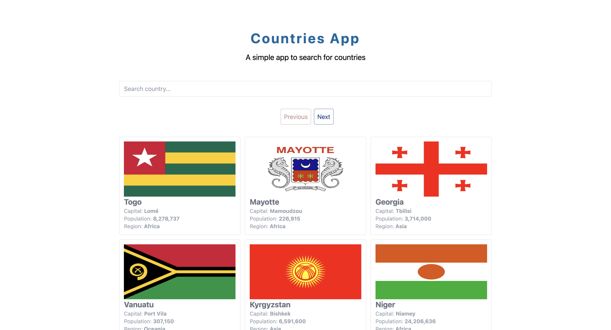
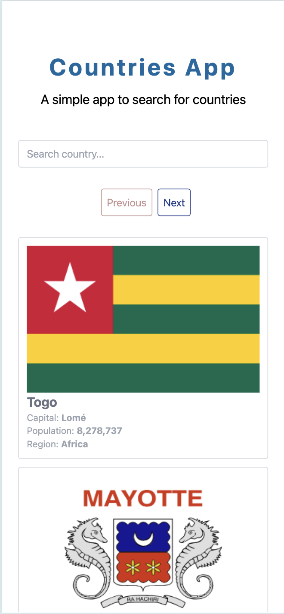
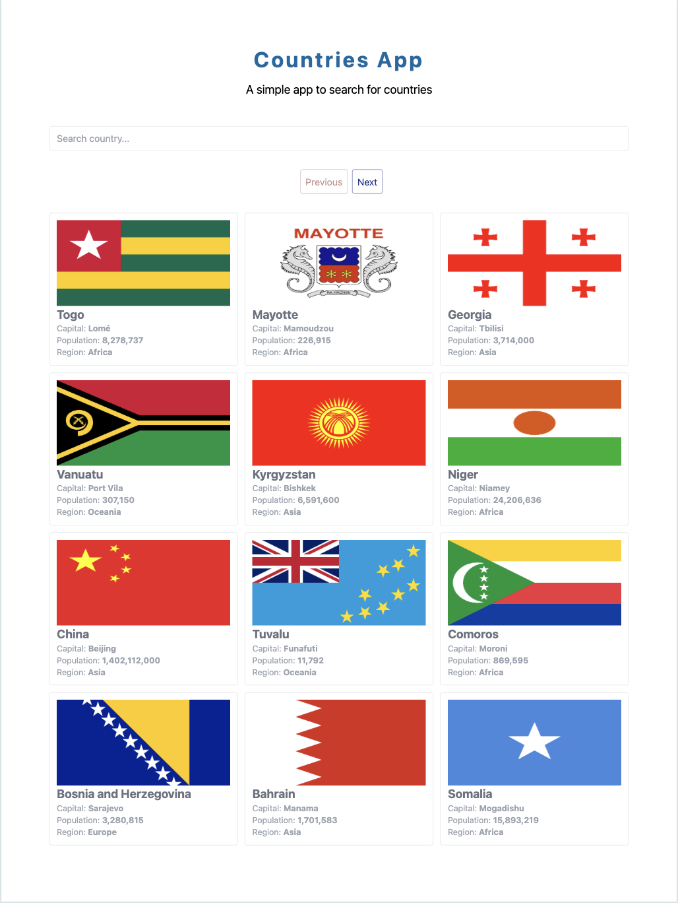

# 🌍 Countries App

Aplicación web que permite **buscar, filtrar y visualizar información de países del mundo**. El objetivo principal es ofrecer una interfaz sencilla e intuitiva para explorar países, ver su capital, población, región y bandera, todo en tiempo real y con paginación integrada.

---

## 🚀 Tecnologías utilizadas

- [Vue 3](https://vuejs.org/)
- [TypeScript](https://www.typescriptlang.org/)
- [Vite](https://vitejs.dev/)
- [TailwindCSS](https://tailwindcss.com/)
- [Axios](https://axios-http.com/)

---

## ✨ Funcionalidades destacadas

- 🔍 **Búsqueda de países por nombre**
- 📄 **Paginación de resultados (botones Next y Previous)**
- 🌐 **Consumo de la API pública [REST Countries](https://restcountries.com/)**
- 🧭 **Visualización de datos clave:** bandera, nombre, capital, población y región
- 📱 **Interfaz responsive y moderna** gracias a TailwindCSS

---

## 🛠️ Instalación y ejecución local

1. Clona el repositorio:

```bash
git clone https://github.com/tuusuario/countries-app.git
cd countries-app
```

2. Instala las dependencias:

```bash
npm install
```

3. Ejecuta el servidor de desarrollo:

```bash
npm run dev
```

4. Abre tu navegador en [`http://localhost:5173`](http://localhost:5173)

---

## 🌐 API utilizada

Esta aplicación consume datos desde la API pública **[REST Countries v3.1](https://restcountries.com/)**.

---

## 📸 Capturas de pantalla

### 💻 Versión de escritorio



### 📱 Versión móvil



### 📱 Versión tablet



---

## 👤 Autor

Desarrollado por **Álvaro Prado**

---
